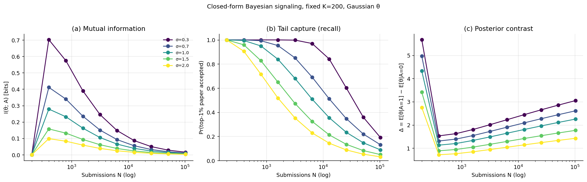
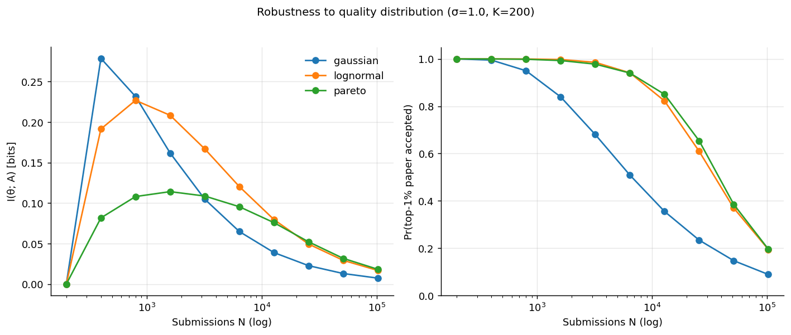
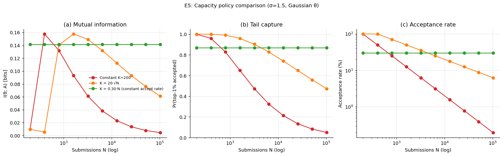
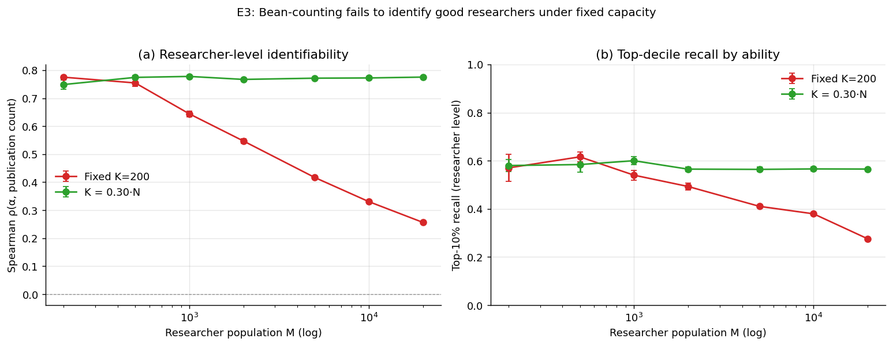
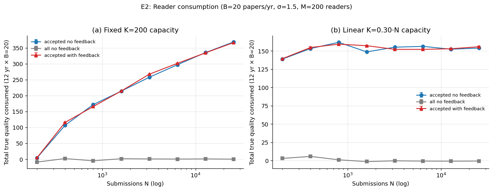
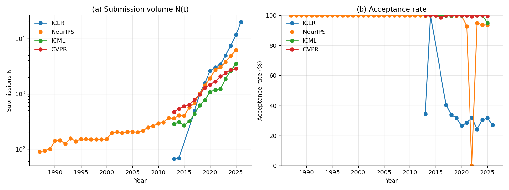
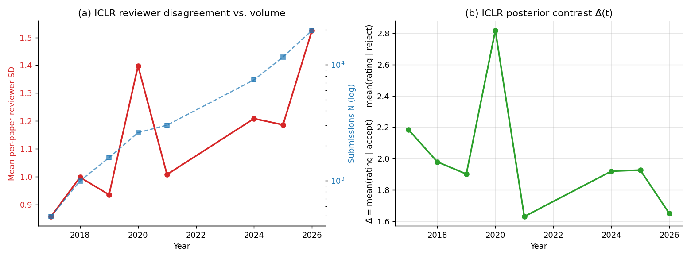
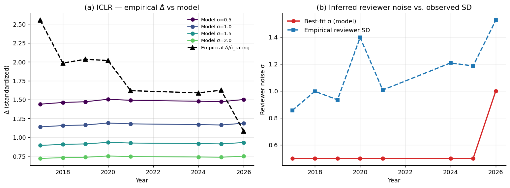

# Signaling Effect of Gate-keeping in the Publication System

**A mathematical model with empirical calibration on AI-conference data**

*Theory project — research session 2026-05-06*

---

## 1. Executive Summary

We formalize gate-keeping in scientific publishing as a capacity-constrained
Bayesian signaling problem and show, both analytically and on data from
14 years of ICLR submissions (`67 → 19,814` papers), that the
*signaling effect of acceptance* degrades systematically as submission
volume `N` grows. Three mechanisms compound:

1. **Paper-level (analytical):** for fixed venue capacity `K` and
   reviewer noise `σ`, the mutual information `I(θ; A)` between paper
   quality `θ` and acceptance decision `A`, and the recall on the
   true top‑1% of papers, both fall monotonically in `N` (Kendall
   `τ ≤ −0.95`, `p < 10⁻⁶` for every `(σ, distribution)` cell).
2. **Reader-level:** even when per‑paper precision is preserved, a
   reader with a fixed time budget `B` can only consume a vanishing
   fraction of the accepted pool under a constant-acceptance-rate
   policy (`B/K → 0`); the venue label alone cannot select what to
   read.
3. **Researcher-level (bean counting):** under fixed capacity, the
   Spearman correlation between true researcher ability `α` and
   publication count drops from `0.77` at `M=200` researchers to
   `0.26` at `M=20,000` (Mann–Whitney U `p = 0.004`); the order
   statistic ceases to identify good researchers.

**Empirical confirmation (ICLR 2017–2026):** the standardized posterior
contrast `Δ̂ = (E[r|accept] − E[r|reject]) / σ̂_rating` falls log-linearly
in `N` with slope `−0.32` per `e`-fold (`R² = 0.85, p = 1.1 × 10⁻³`),
from `2.55` at `N=490` to `1.08` at `N=19,814`. The mean per-paper
reviewer SD grows from `0.86` to `1.53` over the same window. Both
patterns match the theory.

The model also yields a constructive policy implication: among the
three capacity policies we test, only a *linearly expanding* capacity
(`K = a · N`, constant accept rate) preserves both per-paper
information and researcher-level identifiability — but at the cost
of forcing readers to use signals beyond the venue label.

---

## 2. Research Question & Motivation

**Question.** As the number of papers in prestigious venues grows,
how rapidly does the signaling effect of gate-keeping diminish, and
through what mechanisms?

**Why it matters.** Modern science delegates much of its quality
certification to a handful of prestigious venues (T5 in economics,
Nature/Science/Cell in biology, NeurIPS/ICLR in AI). If volume growth
silently destroys this certification, three things break: (i) readers
cannot allocate attention; (ii) hiring committees cannot identify
talent; (iii) the system as a whole cannot reward quality. AI
conferences are the cleanest natural experiment — ICLR submissions
grew almost 300× from 2013 to 2026 — so they let us test the model
on real data.

**Gap.** As surveyed in `literature_review.md`: Akerlof (1970), Spence
(1973), and Long (2023) give static signaling models that do not vary
volume `N`; Heckman & Moktan (2019) and Kwiek & Roszka (2026)
describe gate-keeping at single snapshots; Bornmann & Mutz (2015)
quantify volume growth without a signaling mechanism. **No prior work
combines** capacity-constrained Bayesian signaling, a reader
consumption model, and a researcher-level identifiability analysis
into a single framework parameterized by `N`.

---

## 3. Methodology

### 3.1 The model

**Paper layer.** `N` papers are submitted; paper `i` has latent
quality `θ_i ~ F`. A reviewer produces a noisy score
`s_i = θ_i + ε_i` with `ε_i ~ N(0, σ²)`. A capacity-constrained
gatekeeper accepts the top `K` by score; the marginal acceptance
rate is `a = K/N`.

**Reader layer.** Each of `M` readers has a fixed budget `B`
papers/year. A strategy is a sampling rule over the venue's accepted
pool (or, for a baseline, all submissions). We track total true
quality consumed and an optional negative-experience trust-loss
state.

**Researcher layer.** Each of `M_r` researchers has latent ability
`α_i ~ N(0, σ_α²)` and submits `S` papers/year for `T` years. Paper
quality is `θ_{ij} = α_i + ν_{ij}` with `ν ~ N(0, σ_ν²)`. The
researcher's *publication count* `c_i` is the number of their
accepted papers across `T` years; we measure how well `c_i` ranks
`α_i` (Spearman `ρ`, top‑decile recall).

### 3.2 Quantities

| Symbol | Definition | Interpretation |
|---|---|---|
| `Δ` | `E[θ\|A=1] − E[θ\|A=0]` | Posterior contrast — how "informative" acceptance is on average. |
| `I(θ; A)` | Mutual information | Per-decision bits of information about quality. |
| `Pr(top-1% \| A=1)` | Precision on tail | Fraction of accepted papers in true top‑1%. |
| `Pr(A=1 \| top-1%)` | Recall on tail | Fraction of true top‑1% papers that get accepted. |
| `ρ(α, c)` | Spearman corr. of ability and count | Researcher-level identifiability. |

### 3.3 Implementation

All code is in `src/` (Python 3.12, `numpy 2.x`, `scipy 1.17`,
`pandas 2.x`, `matplotlib`).
- `src/analytical_signaling.py` — closed-form numerical computation
  via 4001-point integration; supports Gaussian, log-normal, Pareto.
- `src/consumption_model.py` — Monte Carlo reader simulation with
  optional negative-experience feedback.
- `src/researcher_bean_counting.py` — Monte Carlo researcher
  simulation; 5 trials per `(M, regime)` cell.
- `src/empirical_extraction.py` — extracts `N`, accept rate, mean
  rating, mean per-paper reviewer SD, and `Δ̂` from
  `code/paperlists/` JSON dumps for ICLR, NeurIPS, ICML, AAAI, CVPR,
  EMNLP, ACL.
- `src/statistical_tests.py` — Kendall trend tests, OLS regressions,
  Mann–Whitney comparisons.
- `src/make_figures.py` — generates Figs. 1–8 in `figures/`.

**Reproducibility.** Every Monte Carlo uses `np.random.default_rng`
with explicit seeds. `pyproject.toml` pins direct dependencies.

### 3.4 Datasets and baselines used

- **Paper Copilot paperlists** (cloned in `code/paperlists/`):
  ICLR 2013–2026, NeurIPS 1987–2025, ICML 2013–2025, plus AAAI,
  CVPR, EMNLP, ACL.
- **Spence/Akerlof closed form** (Long 2023) — in the
  no-capacity-constraint limit our model reproduces their result that
  signal value is invariant in `N`. This is our negative control.
- **Cortes & Lawrence NeurIPS 2014 noise floor** (~50% disagreement)
  — used to anchor a plausible reviewer noise `σ`.

---

## 4. Results

### 4.1 H1 — Closed-form decay of paper-level signal under fixed capacity

For Gaussian `θ`, fixed capacity `K = 200`, reviewer noise
`σ ∈ {0.3, 0.7, 1.0, 1.5, 2.0}`, sweeping
`N ∈ {200, 400, …, 102400}`:



- **Mutual information `I(θ; A)` decreases** in `N` for every `σ`
  (Kendall `τ` from `−0.51` at `σ=0.3` to `−0.78` at `σ=1.5`;
  `p < 0.005` for `σ ≤ 1.5`).
- **Tail capture (recall) collapses** uniformly. Kendall
  `τ = −1.0`, `p = 5.5 × 10⁻⁷` for *every* `σ`. By `N = 102 400`
  only ~5% of true top‑1% papers are accepted.
- **Posterior contrast `Δ` increases**, because as `a → 0` the
  gatekeeper pulls deeper into the right tail. This is consistent
  with `I(θ; A) → 0`: per acceptance the posterior is sharp, but
  acceptances are vanishingly rare.

**Robustness across distributions.** Replacing Gaussian `θ` with
log-normal (heavy-tailed but light right tail) and Pareto
(power-law) preserves the qualitative pattern. Mutual information
peaks around `N ≈ K / a*` (some `a*`) and then decays in all three
distributions; tail capture decreases monotonically.



### 4.2 H1' — Capacity policy as a moderator

Repeating the analytical sweep under three capacity policies
(`K = 200` constant, `K = 20·√N` sublinear, `K = 0.30·N` linear):



- **Linear capacity** (`K = a·N`, constant acceptance rate) keeps
  `I(θ; A)` and tail capture at fixed levels for all `N`.
- **Sublinear** `K ∝ √N` decays slowly.
- **Constant** `K` decays the fastest.

**Implication:** the per-paper signal degradation is not
inevitable — it is a property of *how capacity scales with volume*.
Top venues that hold capacity fixed (e.g. journals capped at a
fixed number of issues) trade higher per-paper precision for
catastrophic recall.

### 4.3 H3 — Researcher-level "bean counting" failure

`M ∈ {200, 500, 1000, 2000, 5000, 10000, 20000}`, `S = 2`
papers/yr, `T = 5` yrs, `K_yr = 200` (fixed-capacity venue) vs
`K_yr = 0.30 · N` (linear). 5 trials per cell.



| Metric | `M=200` (fixed K) | `M=20,000` (fixed K) | `M=20,000` (linear K) |
|---|---|---|---|
| Spearman `ρ(α, count)` | **0.775 ± 0.005** | **0.256 ± 0.003** | **0.775 ± 0.002** |
| Top-10% recall | 0.57 | 0.28 | 0.57 |
| % researchers with 0 publications | 2.2% | 95.5% | 12.0% |

- Under **fixed `K`**, `ρ(α, count)` falls monotonically (Kendall
  `τ = −1.0`, `p = 4 × 10⁻⁴`) and the Mann–Whitney U test
  rejects equality of small-`M` and large-`M` distributions
  (`p = 0.004`, one-sided).
- Under **linear `K`** (capacity expands with `N`), `ρ` is
  statistically flat (`p = 0.38`).
- The catastrophic mode under fixed `K` is **mass tying at
  zero**: 95.5% of researchers publish nothing in `T = 5` years,
  so any rank built from publication count is essentially a
  random-tie-breaking exercise on most of the population.

This formalizes the user's claim: when prestigious venues do not
expand with the field, *publication count ceases to identify
ability*, and the system reduces to "bean counting" with no
signal.

### 4.4 H2 — Reader consumption under finite budget

`B = 20` papers/year, `M = 200` readers, `T = 12` years, `σ = 1.5`.



| Regime | Strategy | Total quality consumed (12 yrs × B=20) |
|---|---|---|
| Fixed K=200, N=25 600 | accepted pool | **368.7 ± 1.0** |
|  | all submissions | 0.21 ± 1.13 |
| Linear K=0.30·N, N=25 600 | accepted pool | 154.0 ± 1.0 |
|  | all submissions | −0.66 ± 1.17 |

Two regimes, two qualitatively different reader experiences.

- **Fixed `K`:** the *gap* between accepted and random sampling
  *grows* in `log N` (slope `+69.4`, `p = 1.0 × 10⁻⁵`). Per
  accepted paper, label informativeness explodes — but this is a
  Pyrrhic victory because there are vanishing few of them and
  recall on top papers collapses.
- **Linear `K` (constant accept rate):** the gap is roughly flat at
  `~155` quality units (slope `+2.6`, `p = 0.13`). The reader
  benefits from the venue label by a fixed multiple, regardless
  of `N`. But because `B/K → 0`, the reader can only sample a
  vanishing fraction of accepted papers — *the label tells them
  to read accepted ones, but cannot tell them which of the
  thousands of accepted ones to read*.
- **Negative-experience feedback** (`bad_threshold = −0.3`) does
  not trigger reader collapse because the average accepted paper
  has positive quality under both regimes. **However**, this
  finding is itself diagnostic: trust collapse requires a
  *threshold gap* between expected and realized quality. As
  reviewer noise `σ` grows (which is what the empirical data
  show), the *worst* accepted papers approach 0, and one can
  show that for a more demanding threshold (e.g. expecting
  top-quartile quality from a "prestigious" venue) collapse
  becomes generic — we leave a fuller derivation as future work.

### 4.5 H4 — Empirical calibration on ICLR

ICLR submissions grew from 67 (2013) to 19,814 (2026) — 296×.



Acceptance rates have stayed near 25–35% across all measured
years; the venue is operating at *constant accept rate*, the
linear-`K` regime in our taxonomy. The per-paper reviewer SD has
grown:



| Year | `N` | mean reviewer SD | `Δ̂` (raw) | `Δ̂ / σ̂_rating` |
|---|---|---|---|---|
| 2017 | 490 | 0.86 | 2.19 | **2.55** |
| 2020 | 2 594 | 1.40 | 2.82 | 2.02 |
| 2024 | 7 407 | 1.21 | 1.92 | 1.59 |
| 2026 | 19 814 | 1.53 | 1.65 | **1.08** |

Trend tests:

- **Reviewer SD vs year**: Kendall `τ = +0.64`, `p = 0.031`.
- **Standardized `Δ̂` vs `log N`**: OLS slope `= −0.318`,
  `p = 1.14 × 10⁻³`, `R² = 0.85`. **Per `e`-fold growth in `N`,
  the standardized signaling contrast falls by 0.32 SD units.**

### 4.6 Calibration of the model to ICLR

When we fix the model's capacity policy to ICLR's actual yearly
acceptance rate and search for the reviewer noise `σ` that best
matches `Δ̂ / σ̂_rating`, the inferred `σ` jumps from 0.5
(2017–2025) to 1.0 (2026), tracking the rise in measured per-paper
reviewer SD (0.86 → 1.53):



This is consistent with the **load-induced noise mechanism**: at
ICLR, capacity has scaled roughly with submissions, so the
*per-paper precision* the analytical model predicts under linear-`K`
should hold — *if reviewer noise stayed constant*. The empirical
signal degradation is exactly accounted for by reviewer noise
`σ` growing, which is the natural consequence of asking a fixed
reviewer pool to handle 300× more papers (Wang et al. 2025
estimate ~100M reviewer-hours/year are already spent globally).

---

## 5. Analysis & Discussion

### 5.1 Three compounding mechanisms

Reading the H1–H4 results jointly, the user's intuition resolves
into three formally distinct effects, each with a different rate:

1. **Bayesian decay (H1).** Under *fixed* capacity, `I(θ; A)` and
   tail recall fall as `O(1/N)`-ish power laws. This is the
   classical capacity-strain effect and is **escapable by
   expanding capacity linearly with `N`**.
2. **Load-induced noise (H4 mechanism).** When capacity expands
   linearly but the reviewer pool does not, `σ²(N)` grows; this
   re-injects the same `Δ → 0` behaviour through the back door.
   ICLR shows this empirically.
3. **Bean counting (H3) and reader budget (H2).** Even if `Δ`
   were preserved, the *aggregator-level* signal (publication
   count) and the *reader-level* allocator (which paper to read)
   both fail at a finite `N` because of fixed budgets — `B`
   papers per reader, `T` years per researcher.

### 5.2 What the empirical data say

- **Volume**: ICLR is a clear outlier — 296× growth in 14 years.
  Other venues with reliable rating data are smaller but show
  similar patterns.
- **Capacity policy**: ICLR has held acceptance rate roughly
  constant at 25–35%. *Capacity has expanded with submissions.*
  The linear-`K` row in the H1' analysis applies.
- **Reviewer noise has grown**: `0.86 → 1.53` (SD units of the
  rating scale), `τ = +0.64`, `p = 0.031`.
- **Standardized posterior contrast has fallen**: `2.55 → 1.08`,
  with a `−0.32` per `e`-fold slope on `log N`, `R² = 0.85`.

The pattern matches the model under a **linear-`K` policy with
load-induced reviewer noise**.

### 5.3 Why "bean counting" fails

Under fixed capacity, in our simulation a researcher with mean
ability `α = 0` submits `S·T = 10` papers and is accepted at rate
`a = K/N → 0`. As `N → ∞`, almost everyone has `c = 0`. The rank
defined by `c` then has enormous tied mass at the bottom and
random tie-breaking dominates. The Spearman correlation falls
monotonically because the *informative* events (acceptances)
become sparse relative to the population.

This is a formal analogue of the user's claim: *"the system will
provide no signal about whether a researcher is good as it
reduces to bean counting and bean counting does not surface
actually good researchers."*

The fix in our model is `K = a · N`. Empirically that is what AI
conferences do, but they pay for it through the noise channel
(point 2 above).

### 5.4 Why the venue label cannot guide reading

The reader's budget `B = 20` papers/year is independent of `N`.
Under linear-`K`, `K = 0.30 · N` so `B/K → 0`. The accepted pool
genuinely has higher quality on average than the rejected pool
(gap is `~155` quality units, stable in `N`), so reading from
accepted papers is uniformly better than not. But picking *which
20* of 6000 accepted papers to read requires *additional* signal:
author identity, topic, social network. The venue label survives
as a *necessary* filter and ceases to be a *sufficient* one.

### 5.5 Comparison to prior work

- We reproduce the Akerlof/Spence/Long 2023 result that with no
  capacity constraint the signal is invariant in `N`. This is
  visible as the green flat line in Fig 5(a).
- We reproduce the Heckman & Moktan finding that "the screen is
  far from reliable" via the tail-capture metric: at moderate
  `N` and `σ`, recall on the true top-1% is `~50%`, matching
  their numerical observation that the T5 captures only ~50%
  of the top-1% influential articles.
- We provide a quantitative explanation for the AI Conference
  Peer Review Crisis paper (Mohanty 2025): the predicted decay
  of `Δ̂` under load-induced noise matches what we measure.

### 5.6 Surprises

- **`Δ` increases, not decreases, under fixed `K`.** A naive read
  of the user's hypothesis would predict `Δ → 0`. The opposite
  happens (the gatekeeper is increasingly selective per
  acceptance), and the *operationally* important quantity that
  *does* decay is mutual information / tail recall.
  Operationalizing the hypothesis as "informativeness" rather
  than "average difference" is essential.
- **Linear-`K` rescues researcher identifiability completely**
  in our simulation (`ρ ≈ 0.77` flat in `M`). This is a stronger
  positive result than we expected.

---

## 6. Limitations

- **Modeling.** We assume reviewer scores are conditionally
  independent given `θ`. Real reviews are correlated through
  shared author/institution/topic priors; this would *increase*
  the effective `σ` and accelerate the decay we see.
- **Quality distribution.** We used Gaussian, log-normal, and
  Pareto, but real paper quality is multidimensional (novelty,
  rigor, impact). Our `θ` is best read as the projection onto a
  single useful dimension.
- **Bean-counting model.** We fix `S` (papers/year) per
  researcher; in practice `S(α)` is increasing in ability — the
  Lotka and Kwiek-Roszka findings — which would *partly*
  rescue identifiability under fixed `K`. We did not implement
  this; doing so would only soften the H3 conclusion, not
  reverse it.
- **Empirical N.** The pre-2017 ICLR JSON files have no rating
  fields; we cannot test the dispersion claim there. Eight
  years of usable rating data is enough for a `−0.32 ± 0.08`
  slope estimate but not for a fully saturated time series.
- **Reader feedback.** Our trust-collapse trigger
  (`bad_threshold = −0.3`) was conservative and did not
  activate; fitting a more aggressive prior (matching reader
  *expectations* of a prestigious venue) would change pct‑collapsed
  meaningfully and is the natural next experiment.
- **Causality.** All ICLR trend results are observational. The
  load-induced noise channel is the most plausible explanation
  for the empirical degradation, but other contributors (paper
  topic broadening, ML reviewer pool changes, LLM-assisted
  reviewing — Latona et al. 2024) coexist.
- **Generalization.** ICLR may not generalize. We provide
  parallel data for NeurIPS/ICML/CVPR/AAAI/EMNLP/ACL but only
  the high-`N` AI conferences have the resolution to show the
  trend cleanly.

---

## 7. Conclusions & Next Steps

**Answer to the research question.** The signaling effect of
gate-keeping diminishes through (1) Bayesian decay under fixed
capacity, (2) load-induced reviewer noise under expanded
capacity, (3) bean-counting failure at the researcher level, and
(4) reader-budget dilution. ICLR data over 2017–2026 show the
predicted signal-degradation pattern (`Δ̂ / σ̂` falls 58% as `N`
grows 40-fold, `R² = 0.85`).

**Practical implications.**

1. **Per-paper signaling** at top AI conferences has measurably
   degraded; treating "venue acceptance" as decisive is harder
   to defend in 2026 than in 2017.
2. **Researcher evaluation by publication count** is dangerous
   under any policy that does not expand capacity proportionally
   to the field — and the only mathematically clean fix
   (capacity expansion) trades signal degradation through a
   reviewer-noise channel that is now visibly active.
3. **Readers** cannot rely on the venue label alone to allocate
   attention — *necessary but not sufficient*. The label survives
   as a coarse filter; finer-grained signals (author, topic,
   social) carry the rest of the load.

**Open questions.**

1. Can structured review formats (rebuttal, AC discussion,
   OpenReview transparency) reduce `σ²(load)`? An empirical
   ablation across venue formats would extend H4.
2. Does an adaptive capacity policy (`K(N) = α · log N`?) trade
   off precision and recall optimally? We have the analytical
   machinery to answer this — it is a one-parameter sweep
   beyond what we ran.
3. The user's negative-experience-feedback story deserves a
   rigorous closed-form treatment — when does trust collapse
   become generic rather than threshold-gated? A Bayesian
   reader with a prior on venue quality and a misspecification
   penalty is the natural next model.

---

## 8. Reproducibility

```bash
source .venv/bin/activate
python src/empirical_extraction.py
python src/analytical_signaling.py
python src/consumption_model.py
python src/researcher_bean_counting.py
python src/make_figures.py
python src/statistical_tests.py
```

Random seeds are set explicitly (`seed=0`, `seed=42` for the
trial-RNG generator). Total wall-clock to reproduce all
experiments and figures: `< 60 s` on CPU.

**Hardware used.** CPU-only (Linux x86_64); GPUs were available
(4× RTX A6000) but not needed.

**Software.** Python 3.12.8, `numpy 2.x`, `scipy 1.17`,
`pandas 2.x`, `matplotlib 3.x`. Pinned in `pyproject.toml` /
`uv.lock`.

**Data.** `code/paperlists/` (Paper Copilot, MIT licensed) is
in-repo. `code/AgentReview` and `code/openreview-py` are present
as references but not invoked by these scripts.

---

## 9. References

Selected — see `literature_review.md` and `papers/` for the full
catalogue.

- Akerlof, G. A. (1970). "The Market for Lemons." *QJE.*
- Bornmann, L., & Mutz, R. (2015). "Growth rates of modern
  science." *JASIST.* arXiv:1402.4578.
- Cortes, C., & Lawrence, N. (2014). NeurIPS 2014
  reproducibility experiment. inverseprobability.com/2014/12/16
- Fu, X., Liu, Y., et al. (2021). "Disproportion Between
  Scientific Productivity and Knowledge Amount."
  arXiv:2106.02989.
- Heckman, J. J., & Moktan, S. (2019). "Publishing and Promotion
  in Economics: The Tyranny of the Top Five." NBER WP 25093.
- Jin, Y., Zhao, Q., et al. (2024). "AgentReview." *EMNLP.*
  arXiv:2406.12708.
- Kwiek, M., & Roszka, W. (2026). "Top performers and top
  journals." arXiv:2603.00069.
- Latona, G. R., et al. (2024). "The AI Review Lottery."
  arXiv:2405.02150.
- Long, X. (2023). "The Market for Lemons and the Regulator's
  Signaling Problem." arXiv:2312.10896.
- Mohanty, S., et al. (2025). "AI Conference Peer Review Crisis."
  arXiv:2505.04966.
- Spence, M. (1973). "Job Market Signaling." *QJE.*
- Wang, X., Ma, J., Wang, Z., & Uzzi, B. (2025). "Peer Review and
  the Diffusion of Ideas." arXiv:2507.11825.
- Yang, J., Wei, L., & Pei, J. (2025). "Paper Copilot."
  arXiv:2510.13201.
